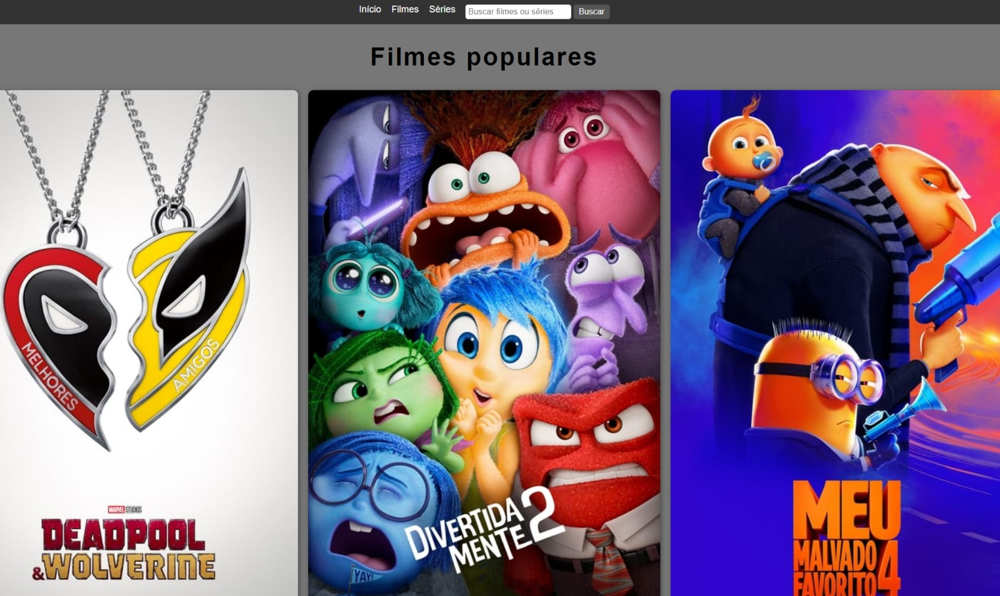
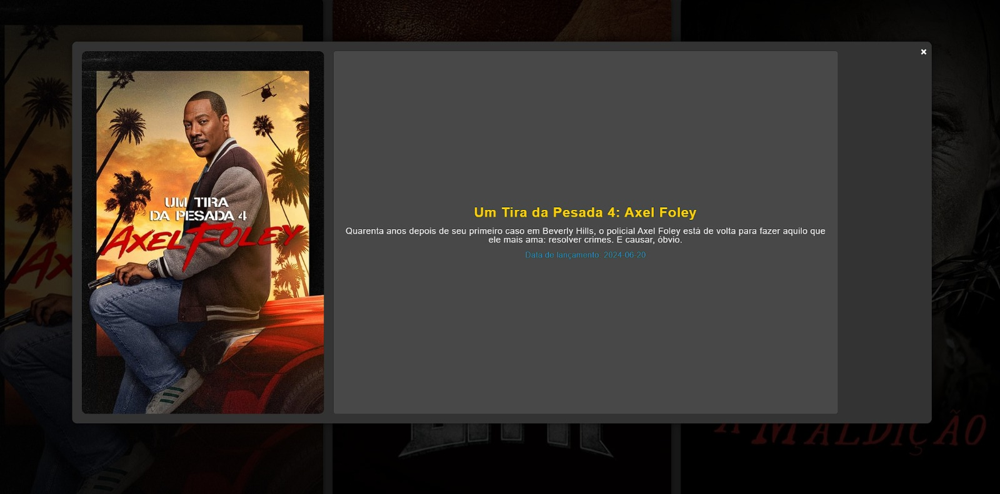

<div align="center">
    
</div>

# ProjetoAPI

## Descrição

Este projeto é uma aplicação web que consome a API do [The Movie Database (TMDb)](https://www.themoviedb.org/) para exibir filmes populares e permitir a busca de filmes por título. A aplicação apresenta um modal com detalhes sobre cada filme quando um usuário clica em "Mais Detalhes".

## Funcionalidades

- **Exibição de Filmes Populares**: Mostra uma lista de filmes populares obtidos da API do TMDb.
- **Busca de Filmes**: Permite buscar filmes por título usando a funcionalidade de busca.
- **Detalhes do Filme**: Exibe um modal com informações detalhadas sobre o filme selecionado, incluindo o título, descrição, poster e data de lançamento.

## Tecnologias Utilizadas

- **HTML5**: Estrutura do conteúdo da página.
- **CSS3**: Estilização e layout da aplicação.
- **JavaScript**: Funcionalidades dinâmicas, como busca e exibição de detalhes.
- **API do TMDb**: Fornecimento de dados sobre filmes.

## Instalação

1. **Clone o repositório**:
    ```bash
    git clone <URL_DO_REPOSITORIO>
    ```

2. **Navegue até o diretório do projeto**:
    ```bash
    cd nome-do-repositorio
    ```

3. **Abra o arquivo `index.html` em um navegador** para visualizar a aplicação.

## Uso

1. **Buscar Filmes**: Digite o nome do filme no campo de busca e clique no botão "Buscar" para encontrar filmes correspondentes.
2. **Visualizar Detalhes do Filme**: Clique no botão "Mais Detalhes" em qualquer filme para abrir um modal com informações detalhadas sobre o filme selecionado.

<div align="center">
    
</div>

## Estrutura do Projeto

- **`index.html`**: Página principal da aplicação.
- **`style.css`**: Arquivo de estilo da aplicação.
- **`script.js`**: Arquivo JavaScript com a lógica para consumir a API e gerenciar a exibição dos filmes e do modal.
- **`reset.css`**: Arquivo de redefinição de estilos básicos.

## Contribuições

Se você deseja contribuir para este projeto, siga estas etapas:

1. **Faça um Fork** do repositório.
2. **Crie uma branch** para sua feature:
    ```bash
    git checkout -b minha-feature
    ```
3. **Faça suas alterações** e faça um commit:
    ```bash
    git commit -am 'Adiciona minha feature'
    ```
4. **Envie a branch** para o repositório remoto:
    ```bash
    git push origin minha-feature
    ```
5. **Abra um Pull Request** para revisão.

## Licença

Este projeto é licenciado sob a [MIT License](LICENSE).

## Contato

Se você tiver alguma dúvida ou sugestão, sinta-se à vontade para entrar em contato:

- **Nome**: [PedroVale]
- **Email**: [ph40200v@gmail.com]
